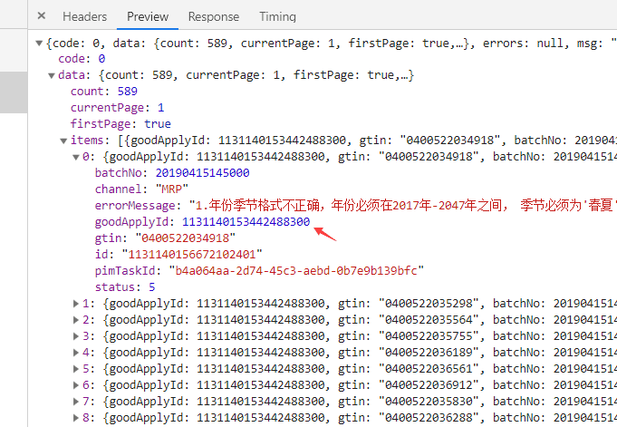

# nodejs-get-post-请求探索
## koa代码

    const koa = require('koa');
    const fs = require('fs');
    const app = new koa();

    const Router = require('koa-router');

    const cors = require('koa2-cors');
    const koaBody = require('koa-body'); //解析文件流
    app.use(koaBody({
    multipart: true,  // 运行多个文件
    strict: true,  //默认true，不解析GET,HEAD,DELETE请求
    formidable: {
        maxFileSize: 2 * 1024 * 1024   // 设置上传文件大小最大限制，默认2M
    }
    }));

    // const bodyParser = require('koa-bodyparser');  // 不支持 form-data
    // app.use(bodyParser({
    //   extendTypes: {
    //     json: ['application/x-javascript', 'application/x-www-form-urlencoded', 'multipart/form-data', 'text/xml'] // 支持的类型
    //   }
    // })); // post 获取参数

    // 
    app.use(cors({
    origin: function (ctx) {
        if (ctx.url === '/test') {
        return "*"; // 允许来自所有域名请求
        }
        return "*"; // 允许来自所有域名请求
        // return 'http://localhost:8080'; // 这样就能只允许 http://localhost:8080 这个域名的请求了
    },
    exposeHeaders: ['WWW-Authenticate', 'Server-Authorization'],
    maxAge: 0,
    credentials: true,
    allowMethods: ['GET', 'PUT', 'POST', 'PATCH', 'DELETE', 'HEAD', 'OPTIONS'],
    allowHeaders: ['Content-Type', 'Authorization', 'Accept'],
    }));

    // 主路由
    let home = new Router();
    home.get('/', async (ctx) => {
    let url = ctx.url;
    let request = ctx.request;
    let req_query = request.query;
    let req_queryString = request.querystring;
    const body = {
        url,
        req_query,
        req_queryString,
    };
    ctx.body = body;
    });

    // 子路由
    let page = new Router();

    page.get('/404', async (ctx) => {
    ctx.body = '404.page!';
    })
    .get('/helloworld', async (ctx) => {
        ctx.body = 'hello world page';
    })
    .get('/init', async (ctx) => {
        ctx.body = ctx.request.query;
    })
    .post('/post', async (ctx) => {
        console.log(ctx.request.query); // 获取 url 后面参数
        const { a, b } = ctx.request.body;
        const body = {
        a, b
        };
        ctx.body = body;
    })
    .post('/postForm', async (ctx) => {
        const { a, b } = ctx.request.body;
        const body = {
        a, b
        };
        ctx.body = body;
    })
    .post('/postText', async (ctx) => { // text/xml
        const body = `
        <a href="http://www.baidu.com">百度链接</a>
        `;
        ctx.body = body;
    })
    .post('/uploadfile', async (ctx) => { //  上传文件
        const file = ctx.request.files.file; // 获取上传文件
        const size = file.size; // 大小
        const type = file.type; // 类型
        const name = file.name; // 名字
        console.log(size, type, name);

        ctx.body = { name };
    });


    // 装载所有子路由
    let router = new Router();
    router.use('/', home.routes(), home.allowedMethods());
    router.use('/test', page.routes(), page.allowedMethods());

    // 加载路由中间件
    app.use(router.routes()).use(router.allowedMethods());

    app.listen(3000, () => {
    console.log('启动成功');
    });

## axios

    <!DOCTYPE html>
    <html lang="en">

    <head>
        <meta charset="UTF-8">
        <meta name="viewport" content="width=device-width, initial-scale=1.0">
        <meta http-equiv="X-UA-Compatible" content="ie=edge">
        <title>Document</title>
        <script src="https://unpkg.com/axios/dist/axios.min.js"></script>
        <style>
            li{
                height: 40px;
                margin-top: 10px;
                cursor: pointer;
            }
        </style>
    </head>

    <body>

        <input type="file" name="a" id="file">
        <button type="submit" onclick="sub()">提交,文件上传形式</button>
        <ul>
            <li onclick="post_json()">一般的json形式，最常见</li>
            <li onclick="post_form()">form表单形式</li>
            <li onclick="post_text()">text形式-不常用</li>
            <li onclick="get_init()">get请求</li>
        </ul>
        <div id="box">
            <h3>请求结果</h3>

        </div>
    </body>
    <script>
        const box = document.querySelector('#box');
        // axios.defaults.headers.common['Authorization'] = 'zhangxinyong'; // 自定义头信息
        // 注意 不要写axios.defaults.headers.post 这样无效
        // axios.defaults.headers['Content-Type'] = 'application/x-www-form-urlencoded'; //  默认的form表单就是这种形式
        // axios.defaults.headers['Content-Type'] = 'multipart/form-data'; // 对文件分割上传
        // axios.defaults.headers['Content-Type'] = 'application/json'; // 最常见的方式。
        // axios.defaults.headers['Content-Type'] = 'text/xml'; // 不常见

        const url = 'http://127.0.0.1:3000/';
        axios.get(url + '?a=4&b=4').then((res) => {
            console.log(res.data);
        });
        function get_init() {
            axios.get(url + 'test/init?a=4&b=4').then((res) => {
                console.log(res.data);
            });
        }
        function post_json() {
            const config = {
                headers: {
                    'Content-Type': 'application/json'
                }
            };
            axios.post(url + 'test/post?x=json', { a: 3, b: 4 }, config).then((res) => {
                console.log(res.data);
            });
        }
        // 一般的form 表单形式
        function post_form() {
            const config = {
                headers: {
                    'Content-Type': 'application/x-www-form-urlencoded'
                }
            };
            const formData = new FormData();
            formData.append('a', 4444444);
            formData.append('b', 33333);
            axios.post(url + 'test/postForm?x=form', formData, config).then((res) => {
                console.log(res.data);
            });
        }
        // multipart/form-data 
        function sub() {
            const formData = new FormData();
            formData.append('file', document.querySelector('#file').files[0]);
            formData.append('type', 2);
            const config = {
                headers: {
                    'Content-Type': 'multipart/form-data'
                }
            };
            axios.post(url + 'test/uploadfile', formData, config).then((res) => {
                console.log(res.data);
            });
        }

        // text 不常用。就不介绍了
        function post_text() {
            const config = {
                headers: {
                    'Content-Type': 'text/xml'
                }
            };
            axios.post(url + 'test/postText?x=text', { a: 3, b: 4 }, config).then((res) => {
                box.innerHTML += res.data;
            });
        }

        // const http = axios.create({
        //     url: 'test/post?x=uuuuuuuu',
        //     baseURL: url,
        //     mthod: 'post',
        //     params: { a: 33, b: 000 }, // url 拼接的
        //     data: {
        //         x: 'cans'
        //     },
        //     // headers: {
        //     //     'Content-Type': 'text/xml'
        //     // }
        // });
        // http.post(url + 'test/post?x=uuuuuuuu', { a: 3, b: 4 }).then((res) => {
        //     console.log(res.data);
        // });
    </script>

    </html>

## axios请求携带cookie报错
<br>
翻译一下他的意思就是说携带cookie的时候后台不能设置为 *
```
const Koa = require('koa');
 const route = require('koa-route');
 const cors = require('koa-cors');
const app = new Koa();

// app.use(cors());
app.use(cors({
    origin: function (ctx) {
        console.log(ctx);
        if (ctx.url == '/data') { // 携带cookie
            return ctx.header.origin;
        } else {
            return '*';
        }
    },
    exposeHeaders: ['WWW-Authenticate', 'Server-Authorization'],
    maxAge: 5,
    credentials: true,
    allowMethods: ['GET', 'POST', 'DELETE'],
    allowHeaders: ['Content-Type', 'Authorization', 'Accept'],
}));
app.use(route.get('/data', (ctx) => {
    console.log(ctx);
    ctx.set
    ctx.body = { data: [1, 2, 3, 4, 45, 5] };
    // return new Promise((resolve, reject) => {
    //     setTimeout(() => {
    //         resolve(ctx.body = { data: [1, 2, 3, 4, 45, 5] })
    //     }, 1000 * 60 * 2.2);
    // })
}));


app.listen(3000, () => {
    console.log('启动成功');
});
```

```
document.cookie = "userId=828";
document.cookie = "userName=zhangsan";
console.log(document.cookie);

const URL = 'http://127.0.0.1:3000';
// axios
axios.defaults.withCredentials = true; // 携带cookie
axios(URL + '/data').then((res) => {
    console.log(res.data);
});
// fetch
fetch(URL + '/data', {
    method: 'GET',
    credentials: 'include' // 允许携带cookie
}).then((res) => {
    console.log(res.data);
});
```
## js 丢失精度
前端通过ajax请求拿到数据json数据然后在展示到页面。今天发现，后端同学给我说，展示的不对


通过上面的图片,可以很清楚的发现，后台返回的和最后转为json的不一样
原因：js的number类型有个最大值（安全值）。即2的53次方，为9007199254740992。如果超过这个值，那么js会出现不精确的问题。
解决办法：后台返回string