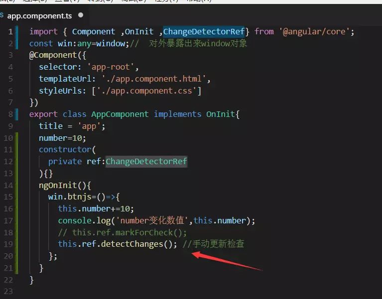
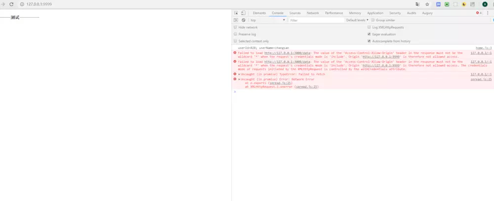

# 日常随笔记录

## angular

### 数据更新视图不刷新

场景：混合开发 app，原生调用 h5js 的方法。这个方法会改变数据，结果打印出来数据是改变的，就是没有反应到视图上。除非用户操作页面。  

解决办法: 手动调用刷新  


## nodejs-get-post-请求探索

### koa 代码

```
   const koa = require('koa');
   const fs = require('fs');
   const app = new koa();

   const Router = require('koa-router');

   const cors = require('koa2-cors');
   const koaBody = require('koa-body'); //解析文件流
   app.use(koaBody({
   multipart: true,  // 运行多个文件
   strict: true,  //默认true，不解析GET,HEAD,DELETE请求
   formidable: {
       maxFileSize: 2 * 1024 * 1024   // 设置上传文件大小最大限制，默认2M
   }
   }));

   // const bodyParser = require('koa-bodyparser');  // 不支持 form-data
   // app.use(bodyParser({
   //   extendTypes: {
   //     json: ['application/x-javascript', 'application/x-www-form-urlencoded', 'multipart/form-data', 'text/xml'] // 支持的类型
   //   }
   // })); // post 获取参数

   //
   app.use(cors({
   origin: function (ctx) {
       if (ctx.url === '/test') {
       return "*"; // 允许来自所有域名请求
       }
       return "*"; // 允许来自所有域名请求
       // return 'http://localhost:8080'; // 这样就能只允许 http://localhost:8080 这个域名的请求了
   },
   exposeHeaders: ['WWW-Authenticate', 'Server-Authorization'],
   maxAge: 0,
   credentials: true,
   allowMethods: ['GET', 'PUT', 'POST', 'PATCH', 'DELETE', 'HEAD', 'OPTIONS'],
   allowHeaders: ['Content-Type', 'Authorization', 'Accept'],
   }));

   // 主路由
   let home = new Router();
   home.get('/', async (ctx) => {
   let url = ctx.url;
   let request = ctx.request;
   let req_query = request.query;
   let req_queryString = request.querystring;
   const body = {
       url,
       req_query,
       req_queryString,
   };
   ctx.body = body;
   });

   // 子路由
   let page = new Router();

   page.get('/404', async (ctx) => {
   ctx.body = '404.page!';
   })
   .get('/helloworld', async (ctx) => {
       ctx.body = 'hello world page';
   })
   .get('/init', async (ctx) => {
       ctx.body = ctx.request.query;
   })
   .post('/post', async (ctx) => {
       console.log(ctx.request.query); // 获取 url 后面参数
       const { a, b } = ctx.request.body;
       const body = {
       a, b
       };
       ctx.body = body;
   })
   .post('/postForm', async (ctx) => {
       const { a, b } = ctx.request.body;
       const body = {
       a, b
       };
       ctx.body = body;
   })
   .post('/postText', async (ctx) => { // text/xml
       const body = `
       <a href="http://www.baidu.com">百度链接</a>
       `;
       ctx.body = body;
   })
   .post('/uploadfile', async (ctx) => { //  上传文件
       const file = ctx.request.files.file; // 获取上传文件
       const size = file.size; // 大小
       const type = file.type; // 类型
       const name = file.name; // 名字
       console.log(size, type, name);

       ctx.body = { name };
   });


   // 装载所有子路由
   let router = new Router();
   router.use('/', home.routes(), home.allowedMethods());
   router.use('/test', page.routes(), page.allowedMethods());

   // 加载路由中间件
   app.use(router.routes()).use(router.allowedMethods());

   app.listen(3000, () => {
   console.log('启动成功');
   });
```

### axios

```
    <!DOCTYPE html>
    <html lang="en">

    <head>
        <meta charset="UTF-8">
        <meta name="viewport" content="width=device-width, initial-scale=1.0">
        <meta http-equiv="X-UA-Compatible" content="ie=edge">
        <title>Document</title>
        <script src="https://unpkg.com/axios/dist/axios.min.js"></script>
        <style>
            li{
                height: 40px;
                margin-top: 10px;
                cursor: pointer;
            }
        </style>
    </head>

    <body>

        <input type="file" name="a" id="file">
        <button type="submit" onclick="sub()">提交,文件上传形式</button>
        <ul>
            <li onclick="post_json()">一般的json形式，最常见</li>
            <li onclick="post_form()">form表单形式</li>
            <li onclick="post_text()">text形式-不常用</li>
            <li onclick="get_init()">get请求</li>
        </ul>
        <div id="box">
            <h3>请求结果</h3>

        </div>
    </body>
    <script>
        const box = document.querySelector('#box');
        // axios.defaults.headers.common['Authorization'] = 'zhangxinyong'; // 自定义头信息
        // 注意 不要写axios.defaults.headers.post 这样无效
        // axios.defaults.headers['Content-Type'] = 'application/x-www-form-urlencoded'; //  默认的form表单就是这种形式
        // axios.defaults.headers['Content-Type'] = 'multipart/form-data'; // 对文件分割上传
        // axios.defaults.headers['Content-Type'] = 'application/json'; // 最常见的方式。
        // axios.defaults.headers['Content-Type'] = 'text/xml'; // 不常见

        const url = 'http://127.0.0.1:3000/';
        axios.get(url + '?a=4&b=4').then((res) => {
            console.log(res.data);
        });
        function get_init() {
            axios.get(url + 'test/init?a=4&b=4').then((res) => {
                console.log(res.data);
            });
        }
        function post_json() {
            const config = {
                headers: {
                    'Content-Type': 'application/json'
                }
            };
            axios.post(url + 'test/post?x=json', { a: 3, b: 4 }, config).then((res) => {
                console.log(res.data);
            });
        }
        // 一般的form 表单形式
        function post_form() {
            const config = {
                headers: {
                    'Content-Type': 'application/x-www-form-urlencoded'
                }
            };
            const formData = new FormData();
            formData.append('a', 4444444);
            formData.append('b', 33333);
            axios.post(url + 'test/postForm?x=form', formData, config).then((res) => {
                console.log(res.data);
            });
        }
        // multipart/form-data
        function sub() {
            const formData = new FormData();
            formData.append('file', document.querySelector('#file').files[0]);
            formData.append('type', 2);
            const config = {
                headers: {
                    'Content-Type': 'multipart/form-data'
                }
            };
            axios.post(url + 'test/uploadfile', formData, config).then((res) => {
                console.log(res.data);
            });
        }

        // text 不常用。就不介绍了
        function post_text() {
            const config = {
                headers: {
                    'Content-Type': 'text/xml'
                }
            };
            axios.post(url + 'test/postText?x=text', { a: 3, b: 4 }, config).then((res) => {
                box.innerHTML += res.data;
            });
        }

        // const http = axios.create({
        //     url: 'test/post?x=uuuuuuuu',
        //     baseURL: url,
        //     mthod: 'post',
        //     params: { a: 33, b: 000 }, // url 拼接的
        //     data: {
        //         x: 'cans'
        //     },
        //     // headers: {
        //     //     'Content-Type': 'text/xml'
        //     // }
        // });
        // http.post(url + 'test/post?x=uuuuuuuu', { a: 3, b: 4 }).then((res) => {
        //     console.log(res.data);
        // });
    </script>

    </html>
```

## axios 请求携带 cookie 报错


翻译一下他的意思就是说携带 cookie 的时候后台不能设置为 \*

```
const Koa = require('koa');
 const route = require('koa-route');
 const cors = require('koa-cors');
const app = new Koa();

// app.use(cors());
app.use(cors({
    origin: function (ctx) {
        console.log(ctx);
        if (ctx.url == '/data') { // 携带cookie
            return ctx.header.origin;
        } else {
            return '*';
        }
    },
    exposeHeaders: ['WWW-Authenticate', 'Server-Authorization'],
    maxAge: 5,
    credentials: true,
    allowMethods: ['GET', 'POST', 'DELETE'],
    allowHeaders: ['Content-Type', 'Authorization', 'Accept'],
}));
app.use(route.get('/data', (ctx) => {
    console.log(ctx);
    ctx.set
    ctx.body = { data: [1, 2, 3, 4, 45, 5] };
    // return new Promise((resolve, reject) => {
    //     setTimeout(() => {
    //         resolve(ctx.body = { data: [1, 2, 3, 4, 45, 5] })
    //     }, 1000 * 60 * 2.2);
    // })
}));


app.listen(3000, () => {
    console.log('启动成功');
});
```

```
document.cookie = "userId=828";
document.cookie = "userName=zhangsan";
console.log(document.cookie);

const URL = 'http://127.0.0.1:3000';
// axios
axios.defaults.withCredentials = true; // 携带cookie
axios(URL + '/data').then((res) => {
    console.log(res.data);
});
// fetch
fetch(URL + '/data', {
    method: 'GET',
    credentials: 'include' // 允许携带cookie
}).then((res) => {
    console.log(res.data);
});
```

## js 部分

### js 丢失精度

前端通过 ajax 请求拿到数据 json 数据然后在展示到页面。今天发现，后端同学给我说，展示的不对  


通过上面的图片,可以很清楚的发现，后台返回的和最后转为 json 的不一样  
原因：js 的 number 类型有个最大值（安全值）。即 2 的 53 次方， 为 9007199254740992。如果超过这个值，那么 js 会出现不精确的问题。  
解决办法：后台返回 string

## nginx 部分

### spa 页面不缓存 index.html

不缓存 add_header ache-Control 'no-cache, no-store'; #这个是错误的，这样会造成 index.html 的 js css 都不缓存  
location = /index.html {  
 add_header Cache-Control "no-cache, no-store";  
}  
正确的设置应该是  
Cache-Control:max-age=0  
Cache-Control 的优先级高于 Expires  
location = /index.html{  
 expires 0;  
}  
在客户端向服务端发送 http 请求时，若返回状态码为 304 Not Modified 则表明此次请求为条件请求。在请求头中有两个请求参数：If-Modified-Since 和 If-None-Match。

当客户端缓存了目标资源但不确定该缓存资源是否是最新版本的时候, 就会发送一个条件请求。在进行条件请求时,客户端会提供给服务器一个 If-Modified-Since 请求头,其值为服务器上次返回响应头中 Last-Modified 值,还会提供一个 If-None-Match 请求头,值为服务器上次返回的 ETag 响应头的值。

服务器会读取到这两个请求头中的值,判断出客户端缓存的资源是否是最新的,如果是的话,服务器就会返回 HTTP/304 Not Modified 响应头, 但没有响应体.客户端收到 304 响应后,就会从本地缓存中读取对应的资源。 所以：当访问资源出现 304 访问的情况下其实就是先在本地缓存了访问的资源。

另一种情况是,如果服务器认为客户端缓存的资源已经过期了,那么服务器就会返回 HTTP/200 OK 响应,响应体就是该资源当前最新的内容.客户端收到 200 响应后,就会用新的响应体覆盖掉旧的缓存资源.只有在客户端缓存了对应资源且该资源的响应头中包含了 Last-Modified 或 ETag 的情况下,才可能发送条件请求.如果这两个头都不存在,则必须无条件(unconditionally)请求该资源,服务器也就必须返回完整的资源数据.另外，有时候我们浏览器调试的时候不希望本地缓存，可以设置取消缓存即可。

- index.html header 头做缓存

```
没有做测试
<meta http-equiv="Pragma" content="no-cache">
<meta http-equiv="Cache-Control" content="no-cache">
<meta http-equiv="Expires" content="0">
```

### 淋雨一直走

Oh  
人都应该有梦  
有梦就别怕痛  
有雷声在轰不停  
雨泼进眼里看不清  
谁急速狂飙  
溅我一身  
的泥泞  
我决定我想去哪里  
往天堂要跳过地狱  
也不恐惧  
不逃避  
这不是脾气  
是所谓志气  
与勇气  
你能推我下悬崖  
我能学会飞行  
从不听  
谁的命令  
很独立  
耳朵用来听自己的心灵  
淋雨一直走  
是一颗宝石就该闪烁  
人都应该有梦  
Oh  
有梦就别怕痛  
淋雨一直走  
是道阳光就该暖和  
人都应该有梦  
Oh  
有梦就别怕痛  
有前面盘旋的秃鹰  
有背后尖酸的耳语  
黑色的童话  
是给长大  
的洗礼  
要独特才是流行  
无法复制的自己  
让我连受伤  
也有型  
这不是脾气  
是所谓志气  
与勇气  
你能推我下悬崖  
我能学会飞行  
从不听  
谁的命令  
很独立  
耳朵用来听自己的心灵  
淋雨一直走  
是一颗宝石就该闪烁  
人都应该有梦  
Oh  
有梦就别怕痛  
淋雨一直走  
是道阳光就该暖和  
人都应该有梦  
Oh  
有梦就别怕痛  
有时掉进黑洞  
有时候爬上彩虹  
在下一秒钟  
命运如何转动  
没有人会晓得 Oh  
我说希望无穷  
你猜美梦成空  
相信和怀疑  
总要决斗  
淋雨一直走  
是一颗宝石就该闪烁  
人都应该有梦  
Oh  
有梦就别怕痛  
淋雨一直走  
是道阳光就该暖和  
人都应该有梦  
Oh  
有梦就别怕痛  
淋雨一直走  
是一颗宝石就该闪烁  
人都应该有梦  
Oh  
有梦就别怕痛  
淋雨一直走  
是道阳光就该暖和  
人都应该有梦  
Oh  
有梦就别怕痛
